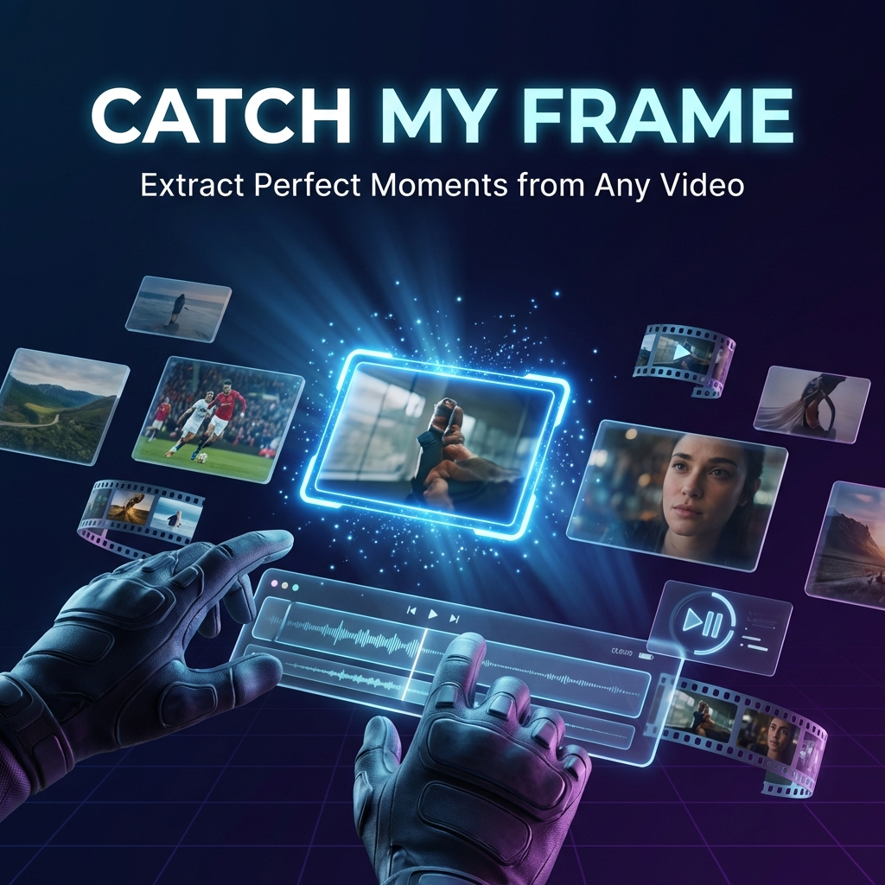

# 🎬 Catch My Frame

<div align="center">



[](https://github.com/CodingWithDodamani/CatchMyFrame)
[](https://react.dev)
[](https://www.typescriptlang.org)
[](https://vitejs.dev)
[](LICENSE)

**A professional browser-based tool for extracting high-quality frames from any video source.**

[Live Demo](#) • [Features](#-features) • [Quick Start](#-quick-start) • [Documentation](#-documentation)

</div>

---

## ✨ Features

### 🎯 **Precision Capture**
- **Frame-by-frame navigation** with millisecond accuracy
- **Lossless PNG export** or high-quality JPEG
- **4K+ resolution support** - preserves original quality
- **DPI injection** for print-ready images

### 🤖 **Smart Automation**
- **AI Scene Detection** - Powered by Google Gemini AI
- **Pixel-difference detection** - Automatically capture scene changes
- **Interval capture** - Set custom FPS for batch extraction
- **Time-range capture** - Define start/end points

### 🎨 **Built-in Editor**
- Brightness, contrast, and saturation controls
- Sharpening filters (Low/Medium/High)
- Real-time preview before export
- Batch editing for all captured frames

### 📦 **Flexible Export**
- Individual frame download (PNG/JPEG)
- Bulk export as ZIP archive
- PDF document generation
- Custom filename formats

### 🔒 **Privacy First**
- **100% client-side processing** - Videos never leave your device
- Works offline with local files
- No data uploaded to servers
- No account required

---

## 🚀 Quick Start

### Prerequisites

- **Node.js** 18+ recommended
- **npm** or **yarn**

### Installation

```bash
# Clone the repository
git clone https://github.com/yourusername/catch-my-frame.git
cd catch-my-frame

# Install dependencies
npm install

# Set up environment variables
cp .env.example .env.local
# Edit .env.local and add your Gemini API key (optional, for AI features)

# Start development server
npm run dev
```

Open [http://localhost:5173](http://localhost:5173) in your browser.

### Production Build

```bash
npm run build
npm run preview
```

---

## 🔧 Configuration

### Environment Variables

Create a `.env.local` file in the project root:

```env
# Required for AI Scene Detection feature
GEMINI_API_KEY=your_gemini_api_key_here
```

> **Note:** The AI Scene Detection feature requires a [Google AI Studio](https://ai.google.dev/) API key. All other features work without an API key.

---

## 📖 Documentation

### Keyboard Shortcuts

| Shortcut | Action |
|----------|--------|
| `Space` / `K` | Play/Pause video |
| `←` / `→` | Seek 5 seconds |
| `,` / `.` | Frame step backward/forward |
| `C` / `Enter` | Capture current frame |

### Supported Video Sources

- **Local files:** MP4, WebM, MOV, M4V
- **YouTube URLs:** Direct links, shorts, embeds
- **Screen capture:** Record browser tabs (Chrome/Edge)

### Auto-Capture Modes

| Mode | Description |
|------|-------------|
| **Interval** | Capture at fixed FPS (1-60) |
| **Time Range** | Capture within start/end boundaries |
| **Pixel Detect** | Capture on scene changes |
| **AI Detect** | Gemini-powered smart detection |

---

## 🛠️ Tech Stack

- **Frontend:** React 19, TypeScript
- **Build Tool:** Vite 6
- **Styling:** Tailwind CSS
- **Icons:** Lucide React
- **AI:** Google Gemini API
- **Export:** JSZip, FileSaver

---

## 📁 Project Structure

```
catch-my-frame/
├── components/          # React components
│   ├── ui/             # Reusable UI components
│   ├── sections/       # Page sections (Features, Pricing, etc.)
│   ├── context/        # React contexts (Theme, Toast)
│   └── icons.tsx       # Custom SVG icons
├── index.css           # Global styles & theme
├── App.tsx             # Main application router
├── types.ts            # TypeScript definitions
└── utils.ts            # Utility functions
```

---

## 🤝 Contributing

Contributions are welcome! Please feel free to submit a Pull Request.

1. Fork the repository
2. Create your feature branch (`git checkout -b feature/AmazingFeature`)
3. Commit your changes (`git commit -m 'Add some AmazingFeature'`)
4. Push to the branch (`git push origin feature/AmazingFeature`)
5. Open a Pull Request

---

## 📄 License

This project is licensed under the MIT License - see the [LICENSE](LICENSE) file for details.

---

## 👤 Author

**Hallu Dodamani**

- GitHub: [@halludodamani](https://github.com/halludodamani)

---

<div align="center">

Made with ❤️ by Hallu Dodamani

⭐ Star this repo if you find it useful!

</div>
